# Capstone Project : Create DBT Discrepancy model and Airflow Scheduling

## 💻 Scenario
C.V. Untung yang selama ini menggunakan pencatatan penjualan di spreadsheet baru saja beralih menggunakan sistem ERP.

Stakeholder C.V. Untung perlu melakukan monitoring apakah ada perbedaan pencatatan antara sistem ERP dan pencatatan di spreadsheet.

Dengan adanya analisis perbedaan (discrepancy) antara sistem ERP dan spreadsheet, maka stakeholder bisa memutuskan:

- Apakah sistem ERP sudah berjalan dengan baik dan bisa menggantikan pencatatan di spreadsheet
- Apakah ada SOP yang perlu diperbaiki
- Apakah data dari sistem ERP bisa dipakai untuk kepentingan analiisis.
- Apakah perbaikan sistem ERP dan perbaikan SOP mengurangi, atau justru menambah discrepancy secara total.

## ⚔️ Challenge

- Data terpisah berasal dari multiple source seperti db, excel, dan data source yg lain.
- Constraint setiap problem akan spesifik ditentukan pada bagian project description.

## 🎯 Goals

- Melakukan pengambilan data, include orchestration, transformation. i.e., ETL (Mandatory)
- Melakukan pengambilan data agregasi dari db + excel (Mandatory)


## ⚒️ Tools
- Airbyte (Ingestion)
- Airflow (Orchestration)
- SQL (Data Source 1)
- .CSV (Data Source 2)
- Postgres (Data Warehouse)
- Citus (Data Base)

## 📈 ETL
- Data source 1 (SQL) :

```
  ┌───────────┐        ┌──────────────┐        ┌─────────────┐
  │           │        │              │        │             │
  │    SQL    ├────────┤    Airbyte   ├────────┤    Citus    │
  │           │        │              │        │             │
  └───────────┘        └──────────────┘        └─────────────┘
```

- Data source 2 (CSV) :

```
  ┌───────────┐        ┌──────────────┐        ┌─────────────┐
  │           │        │              │        │             │
  │    CSV    ├────────┤    Airbyte   ├────────┤    Citus    │
  │           │        │              │        │             │
  └───────────┘        └──────────────┘        └─────────────┘
```

## ⌚ Orchestrating
Orchestrating di airflow dilakukan dengan cara scheduling task ingesting dan transform
```
  ┌───────────┐        ┌──────────────┐        
  │           │        │              │        
  │   Ingest  ├───────>|  Transform   |
  │           │        │              │       
  └───────────┘        └──────────────┘        
```

# Clone this project:
```bash
git clone https://github.com/iwangmoeslem/ALTA-Capstone-Project.git
```


# Start Docker Compose
Click [here](docker-compose.yml) to see the content

```bash
docker compose up -d
```
# Ingesting data on Airbyte
1. Buat koneksi postgres pada dbeaver di port `5432`
2. Untuk data source sql, jalankan query di `ddl.sql`
3. Setelah tabel terbentuk, masukkan data pada setiap tabel di `product.sql, sales.sql, sales_item.sql`
4. Datasource sudah tersimpan di database postgres local
5. Akses Airbyte UI di `localhost:80000` dengan username dan password:
```bash
username : airbyte
password : password
```
5. Buat koneksi dari postgres (5432) ke citus (15432) lalu sinkronkan data
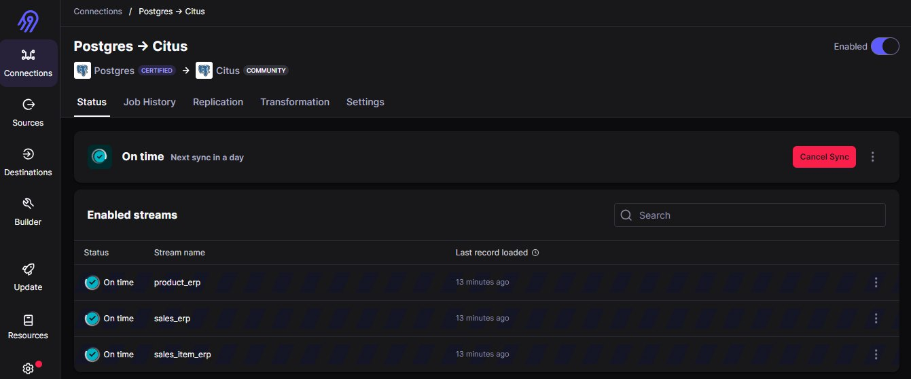
6. Lakukan hal yang sama dengan datasource CSV
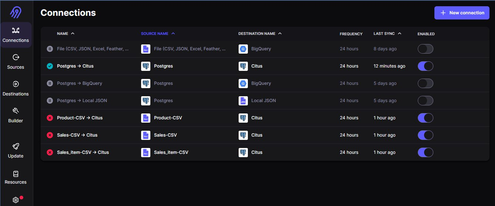
7. Cek apakah data sudah ter-ingest dengan melihat daftar tabel yang ada pada docker container citus
```bash
docker exec -it citus bash
psql -U postgres
\dt
```
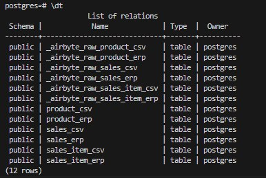


# Data Modeling
## Install DBT locally:
Sesuaikan versi dbt dengan kebutuhan

```bash
pip install dbt-core 1.7.4
```

## Setup DBT profiles
- Buat sebuah folder untuk menyimpan direktori file profiles.yml
- Jangan lupa untuk menjalankan command export di bawah setiap akan mengoperasikan dbt
```bash
cd docker-dep/airflow-dag/dbt-profiles
export DBT_PROFILES_DIR=$(pwd)
```
- Untuk mengecek apakah direktori sudah tersimpan, jalankan perintah ini:

```bash
echo $DBT_PROFILES_DIR
```
- Jika output dari perintah di atas adalah alamat menuju profiles.yml, maka value DBT_PROFILES_DIR sudah tersimpan

`dbt-profiles.yml: `
```yml
dbt_project:
  outputs:
    dev:
      type: postgres
      threads: 1
      host: host.docker.internal
      port: 15432
      user: postgres
      pass: postgres
      dbname: postgres
      schema: public

  target: dev
```

## Setup DBT project configuration
Konfigurasi project DBT adalah sebuah file untuk mengatur bagaimana skema atau alur dari sebuah project DBT, file ini bisa ditemukan di:
`docker-dep/airflow-dag/dbt-project/dbt_project.yml`

Konfigurasi DBT di project ini adalah seperti berikut:

```yml
models:
  dbt-project:
    # Config indicated by + and applies to all files under models/example/
    postgres:
      +schema: public
      +database: postgres
    sales_discrepancy:
      +materialized: table
      +schema: sales_discrepancy
      +database: postgres
    sales_detail_discrepancy:
      +materialized: table
      +schema: sales_detail_discrepancy
      +database: postgres
    daily_sales_discrepancy:
      +materialized: table
      +schema: daily_sales_discrepancy
      +database: postgres
    monthly_sales_discrepancy:
      +materialized: table
      +schema: monthly_sales_discrepancy
      +database: postgres
```
Terdapat 4 model yang akan dibuat sesuai dengan Goals project ini yaitu discrepancy dari kedua data source:

- Sales discrepancy 
- Sales detail discrepancy
- Daily sales discrepancy
- Monthly sales discrepancy

## Setup source
Source bisa ditemukan di `airflow-dag/store/schema.yml`

```yml
version: 2

sources:
  - name: postgres
    database: postgres
    schema: public

    tables:
      - name: sales_erp
        columns:
          - name: sales_id
            description: "Unique identifier for each sales transaction"
            tests:
              - unique
              - not_null
          - name: sales_at
            description: "Timestamp when the sale occurred"
            tests:
              - not_null
          - name: shipping
            description: "Shipping cost for the sale"
          - name: discount
            description: "Discount applied to the sale"
          - name: total_transaction
            description: "Total transaction amount for the sale"
            tests:
              - not_null

      - name: products_erp
        columns:
          - name: product_id
            description: "Unique identifier for each product"
            tests:
              - unique
              - not_null
          - name: product_name
            description: "Name of the product"
            tests:
              - not_null
          - name: last_price
            description: "Last known price of the product"
            tests:
              - not_null

      - name: sales_item_erp
        columns:
          - name: sales_id
            description: "Foreign key referencing sales"
            tests:
              - relationships:
                  to: source('store', 'sales_erp')
                  field: sales_id
          - name: product_id
            description: "Foreign key referencing products"
            tests:
              - relationships:
                  to: source('store', 'products_erp')
                  field: product_id
          - name: qty
            description: "Quantity of the product sold in the transaction"
            tests:
              - not_null
          - name: price
            description: "Price of the product in the order"
            tests:
              - not_null
          - name: subtotal
            description: "Subtotal for the product in the sale"
            tests:
              - not_null

      - name: sales_csv
        columns:
          - name: sales_id
            description: "Unique identifier for each sales transaction"
            tests:
              - unique
              - not_null
          - name: sales_at
            description: "Timestamp when the sale occurred"
            tests:
              - not_null
          - name: shipping
            description: "Shipping cost for the sale"
          - name: discount
            description: "Discount applied to the sale"
          - name: total_transaction
            description: "Total transaction amount for the sale"
            tests:
              - not_null

      - name: products_csv
        columns:
          - name: product_id
            description: "Unique identifier for each product"
            tests:
              - unique
              - not_null
          - name: product_name
            description: "Name of the product"
            tests:
              - not_null
          - name: last_price
            description: "Last known price of the product"
            tests:
              - not_null

      - name: sales_item_csv
        columns:
          - name: sales_id
            description: "Foreign key referencing sales"
            tests:
              - relationships:
                  to: source('store', 'sales_csv')
                  field: sales_id
          - name: product_id
            description: "Foreign key referencing products"
            tests:
              - relationships:
                  to: source('store', 'products_csv')
                  field: product_id
          - name: qty
            description: "Quantity of the product sold in the transaction"
            tests:
              - not_null
          - name: price
            description: "Price of the product in the order"
            tests:
              - not_null
          - name: subtotal
            description: "Subtotal for the product in the sale"
            tests:
              - not_null
```

## Models
Model discrepancy bisa ditemukan di `airflow-dag/dbt-project/models`


#### 1. `Daily Sales Discrepancy`
```sql
WITH daily_sales_comparison AS (
    SELECT
        e.sales_id AS system_order_id,
        e.sales_at AS system_datetime,
        e.discount AS system_total_discount,
        e.shipping AS system_total_shipping,
        e.total_transaction AS system_total_transaction,
        c.sales_id AS spreadsheet_order_id,
        c.sales_at AS spreadsheet_datetime,
        c.discount AS spreadsheet_total_discount,
        c.shipping AS spreadsheet_total_shipping,
        c.total_transaction AS spreadsheet_total_transaction
    FROM
        {{ source('postgres', 'sales_erp') }} AS e
    JOIN
        {{ source('postgres', 'sales_csv') }} AS c
    ON 
        e.sales_id = c.sales_id
)

SELECT
    DATE_TRUNC('day', COALESCE(system_datetime, spreadsheet_datetime)) AS day_bucket,
    SUM(ABS(COALESCE(system_total_transaction, 0) - COALESCE(spreadsheet_total_transaction, 0))) AS total_discrepancy,
    SUM(CASE WHEN system_total_discount <> spreadsheet_total_discount THEN 1 ELSE 0 END) AS inequal_total_discount_discrepancy,
    SUM(CASE WHEN system_total_shipping <> spreadsheet_total_shipping THEN 1 ELSE 0 END) AS inequal_total_shipping_discrepancy,
    SUM(CASE WHEN system_total_transaction <> spreadsheet_total_transaction THEN 1 ELSE 0 END) AS invalid_system_calculation_discrepancy,
    SUM(CASE WHEN system_total_transaction <> spreadsheet_total_transaction THEN 1 ELSE 0 END) AS invalid_spreadsheet_calculation_discrepancy
FROM
    daily_sales_comparison
GROUP BY
    DATE_TRUNC('day', COALESCE(system_datetime, spreadsheet_datetime))
```

#### 2. `Monthly Sales Discrepancy`

```sql

WITH monthly_sales_comparison AS (
    SELECT
        e.sales_id AS system_order_id,
        e.sales_at AS system_datetime,
        e.discount AS system_total_discount,
        e.shipping AS system_total_shipping,
        e.total_transaction AS system_total_transaction,
        c.sales_id AS spreadsheet_order_id,
        c.sales_at AS spreadsheet_datetime,
        c.discount AS spreadsheet_total_discount,
        c.shipping AS spreadsheet_total_shipping,
        c.total_transaction AS spreadsheet_total_transaction
    FROM
        sales_erp  AS e
    JOIN
        sales_csv  AS c
    ON 
        e.sales_id = c.sales_id
)
SELECT
    DATE_TRUNC('month', COALESCE(system_datetime, spreadsheet_datetime)) AS month_bucket,
    SUM(ABS(COALESCE(system_total_transaction, 0) - COALESCE(spreadsheet_total_transaction, 0))) AS total_discrepancy,
    SUM(CASE WHEN system_total_discount <> spreadsheet_total_discount THEN 1 ELSE 0 END) AS inequal_total_discount_discrepancy,
    SUM(CASE WHEN system_total_shipping <> spreadsheet_total_shipping THEN 1 ELSE 0 END) AS inequal_total_shipping_discrepancy,
    SUM(CASE WHEN system_total_transaction <> spreadsheet_total_transaction THEN 1 ELSE 0 END) AS invalid_system_calculation_discrepancy,
    SUM(CASE WHEN system_total_transaction <> spreadsheet_total_transaction THEN 1 ELSE 0 END) AS invalid_spreadsheet_calculation_discrepancy
FROM
    monthly_sales_comparison
GROUP BY
    DATE_TRUNC('month', COALESCE(system_datetime, spreadsheet_datetime))
```


#### 3. `Sales Detail Discrepancy`

```sql
WITH sales_detail_comparison AS (
    SELECT
        e.sales_id AS system_order_id,
        e.product_id AS system_item_id,
        e.qty AS system_qty,
        e.price AS system_price,
        e.subtotal AS system_subtotal,
        c.sales_id AS spreadsheet_order_id,
        c.product_id AS spreadsheet_item_id,
        c.qty AS spreadsheet_qty,
        c.price AS spreadsheet_price,
        c.subtotal AS spreadsheet_subtotal
    FROM
        {{ source('postgres', 'sales_item_erp') }} AS e
    JOIN
        {{ source('postgres', 'sales_item_csv') }} AS c 
    ON 
        e.sales_id = c.sales_id
)

SELECT
    system_order_id,
    system_item_id,
    system_qty,
    system_price,
    system_subtotal,
    spreadsheet_order_id,
    spreadsheet_item_id,
    spreadsheet_qty,
    spreadsheet_price,
    spreadsheet_subtotal,
    ABS(system_subtotal - spreadsheet_subtotal) AS discrepancy
FROM
    sales_detail_comparison
```


#### 4. `Sales Discrepancy`
```sql
WITH sales_detail_comparison AS (
    SELECT
        e.sales_id AS system_order_id,
        e.product_id AS system_item_id,
        e.qty AS system_qty,
        e.price AS system_price,
        e.subtotal AS system_subtotal,
        c.sales_id AS spreadsheet_order_id,
        c.product_id AS spreadsheet_item_id,
        c.qty AS spreadsheet_qty,
        c.price AS spreadsheet_price,
        c.subtotal AS spreadsheet_subtotal
    FROM
        {{ source('postgres', 'sales_item_erp') }} AS e
    JOIN
        {{ source('postgres', 'sales_item_csv') }} AS c 
    ON 
        e.sales_id = c.sales_id
)

SELECT
    system_order_id,
    system_item_id,
    system_qty,
    system_price,
    system_subtotal,
    spreadsheet_order_id,
    spreadsheet_item_id,
    spreadsheet_qty,
    spreadsheet_price,
    spreadsheet_subtotal,
    ABS(system_subtotal - spreadsheet_subtotal) AS discrepancy
FROM
    sales_detail_comparison
```

# Airflow Scheduling
Agar project ini bisa diotomasi, perlu dilakukan orchrestrating menggunakan airflow DAG. 
1. Akses airflow di `localhost:8080` dengan credential:
```bash
username : admin1
password : admin1
```

2. Buat koneksi airbyte dan citus di airflow
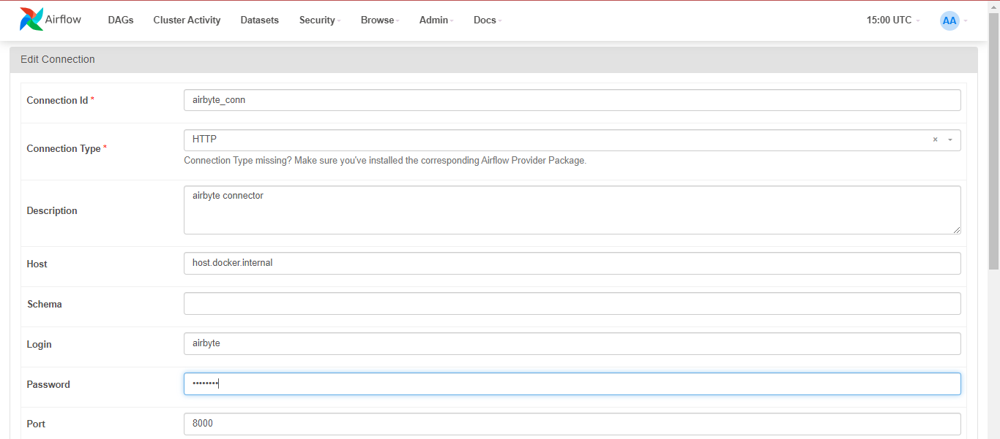
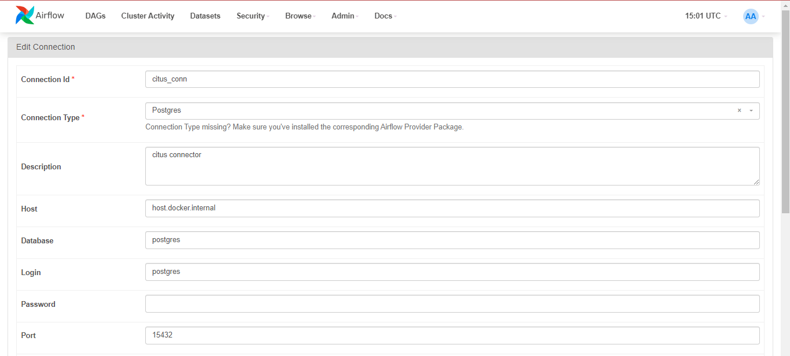

3. Buat DAG untuk data ingesting dan data modeling. DAG dapat dilihat di `docker-dep/airflow-dag`
- Proses ingesting dilakukan dengan urutan `ingest sql -> ingest csv -> done`
```python
from datetime import datetime, timedelta
from airflow import DAG
# from airflow.providers.postgres.transfers.postgres_to_postgres import PostgresToPostgresOperator
from airflow.providers.airbyte.operators.airbyte import AirbyteTriggerSyncOperator
from airflow.operators.dummy_operator import DummyOperator


default_args = {
    'owner': 'airflow',
    'depends_on_past': False,
    'start_date': datetime(2024, 1, 1),
    'retries': 1,
    'retry_delay': timedelta(minutes=5),
}

dag = DAG(
    'ingest_to_citus',
    default_args=default_args,
    description='A DAG to ingest data into Citus using Airbyte',
    schedule_interval=timedelta(days=1)

)

# Define tasks
ingest_erp = AirbyteTriggerSyncOperator(
    task_id='ingest-sql-to-citus',
    airbyte_conn_id = 'airbyte_conn',
    connection_id = '1484321b-27df-42c2-bdd0-9bdb893bf1c4',
    asynchronous=False,
    timeout=3600,
    wait_seconds=3,
    dag=dag,
)


ingest_product_csv = AirbyteTriggerSyncOperator(
    task_id='ingest-product_csv-to-citus',
    airbyte_conn_id = 'airbyte_conn',
    connection_id = 'bd8504c1-20d0-453a-a5c7-bffa785e2ee2',
    asynchronous=False,
    timeout=3600,
    wait_seconds=3,
    dag=dag,
)

ingest_sales_csv = AirbyteTriggerSyncOperator(
    task_id='ingest-sales_csv-to-citus',
    airbyte_conn_id = 'airbyte_conn',
    connection_id = '813304ae-574f-4f3e-9d40-42c5895d4f95',
    asynchronous=False,
    timeout=3600,
    wait_seconds=3,
    dag=dag,
)

ingest_sales_item_csv = AirbyteTriggerSyncOperator(
    task_id='ingest-sales_item_csv-to-citus',
    airbyte_conn_id = 'airbyte_conn',
    connection_id = '1c96b05e-2582-46d8-8261-4fb5691d46dc',
    asynchronous=False,
    timeout=3600,
    wait_seconds=3,
    dag=dag,
)

end_task = DummyOperator(
    task_id='end_task',
    dag=dag,
)

# task dependencies
ingest_erp >> ingest_sales_csv >> ingest_product_csv >> ingest_sales_item_csv >> end_task
```

- Proses modeling 
```python
from airflow import DAG
from airflow.operators.bash import BashOperator
from datetime import timedelta, datetime


default_args = {
    'owner': 'airflow',
    'depends_on_past': False,
    'start_date': datetime(2024, 1, 1),
    'retries': 1,
    'retry_delay': timedelta(minutes=5),
}

dag = DAG(
    'run-dbt-models',
    default_args=default_args,
    description='A DAG to run dbt models',
    schedule_interval=timedelta(days=1)
)

#task
dbtmodel = BashOperator(
    task_id = 'dbt-model',

    bash_command=' && '.join([
            'cd /opt/airflow/dags/dbt-profiles',
            # 'source .venv/Scripts/activate',
            'export DBT_PROFILES_DIR=$(pwd)', 
            'cd ../dbt-project',
            'dbt run',
    ]),
    dag=dag  
)

dbtmodel 
```

4. Trigger DAG
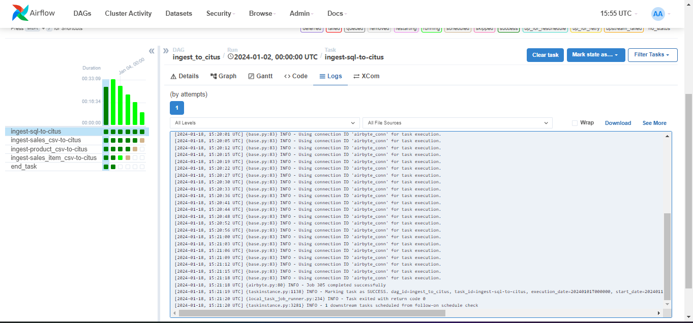
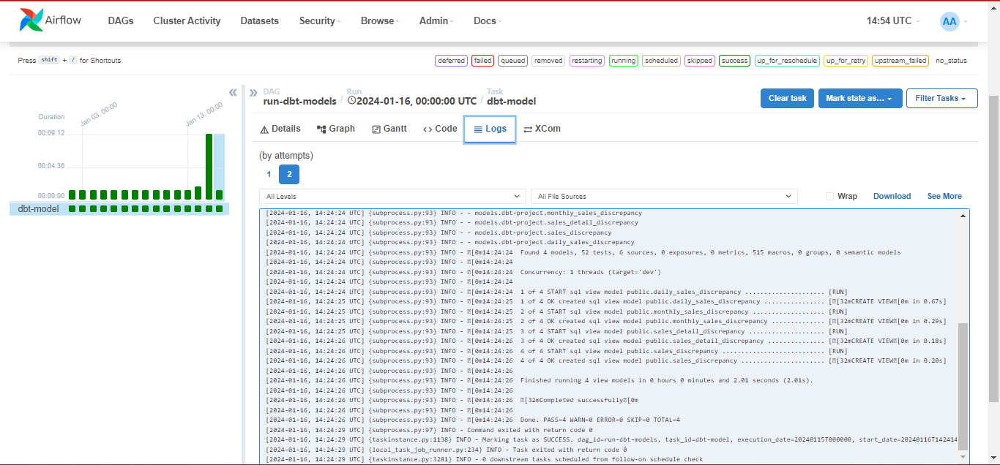

5. Cek hasil query dari model
- Sales discrepancy
  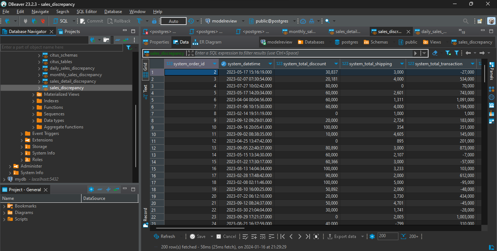
- Sales detail discrepancy
  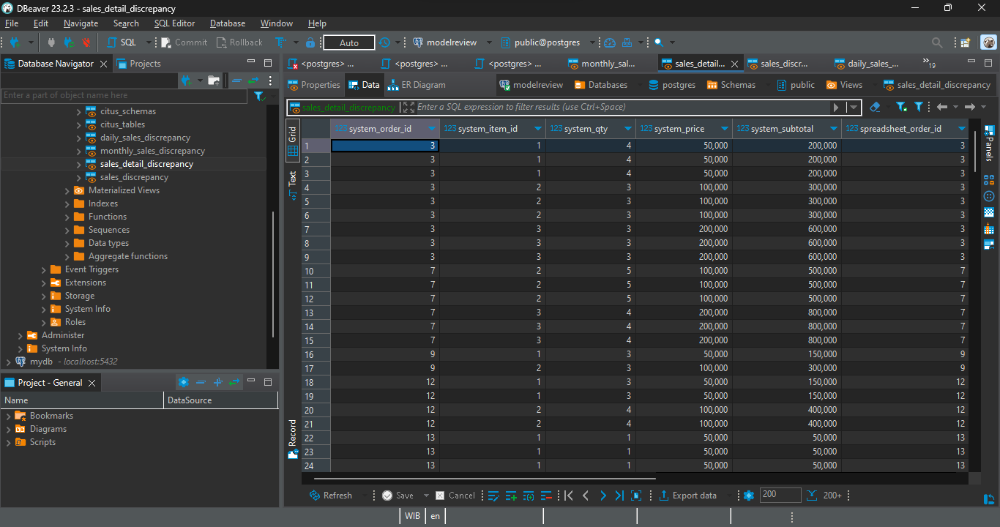
- Daily sales discrepancy
  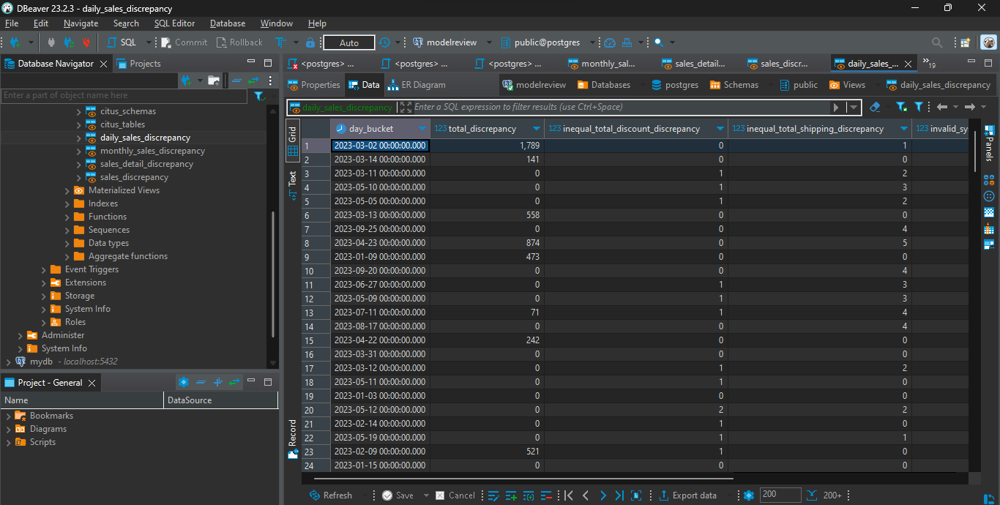
- Monthly sales discrepancy
  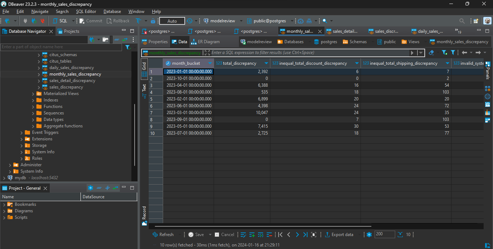

# Visualisasi discrepancy
Visualisasi discrepancy dibuat menggunakan [lookerstudio](https://lookerstudio.google.com/s/vsj2ohZ8B78)